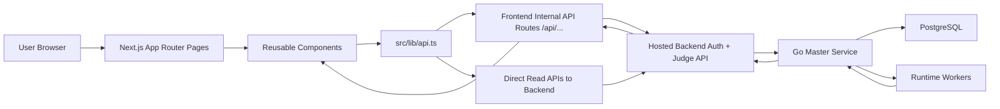

# CodeForge Frontend Explanation For Evaluation And Viva

## 1. Short Intro You Can Say In Viva

I handled the complete frontend of CodeForge. The frontend is built using Next.js, React, TypeScript, Tailwind CSS, Monaco Editor, and a few supporting libraries. My responsibility was to design the user-facing layer where users can register, log in, browse coding problems, open an interactive problem-solving workspace, write code in an editor, select a runtime, submit the solution to the judge, and then see the verdict and previous submissions. I also created the frontend-side API integration layer so the UI can communicate cleanly with the backend judge and auth services.

If you want a shorter version:

> I built the full frontend for CodeForge. It includes authentication screens, the problem dashboard, the split-screen coding workspace, runtime-based code submission, verdict polling, and submission history integration with the backend judge system.

---

## 2. What The Frontend Is Responsible For

The frontend is the presentation and interaction layer of CodeForge. Its main responsibilities are:

- showing the list of available problems
- allowing users to search, sort, filter, and paginate problems
- opening an individual problem page with full statement, constraints, and examples
- rendering mathematical content properly
- providing a Monaco-based code editor similar to real coding platforms
- allowing the user to choose a runtime such as C++, C, Python, or JavaScript
- submitting code to the backend judge
- polling the backend for verdict updates until execution finishes
- showing runtime statistics, wrong-answer details, and stderr
- showing a lightweight login/register/profile flow
- showing previous submissions of the current problem

So the frontend is not only "UI design"; it is also the orchestration layer between the user and the backend online judge.

---

## 3. Tech Stack And Why It Was Chosen

| Technology | Why it is used in this frontend |
| --- | --- |
| `Next.js 16` | Gives routing, server/client component split, App Router, loading states, and API routes in one framework. |
| `React 19` | Used for interactive UI and state-driven rendering. |
| `TypeScript` | Helps keep API contracts and component props strongly typed. |
| `Tailwind CSS 4` | Used for fast utility-based styling and consistent design. |
| `@monaco-editor/react` | Provides the main code editor experience similar to VS Code. |
| `lucide-react` | Used for icons in buttons, navigation, status indicators, and cards. |
| `html-react-parser` | Converts HTML-like content from problem statements into React elements. |
| `KaTeX` | Renders mathematical expressions in problem statements. |

Important point for viva:

- Next.js is not used only for pages; it is also used for internal API proxy routes.
- React handles interactivity.
- Tailwind handles styling.
- Monaco handles coding.
- the backend judge still does the actual code execution and verdict generation.

---

## 4. Frontend Architecture In One View

### Simple explanation of this architecture

There are two main data access patterns in the frontend:

1. `Direct read access` for fetching problem lists and problem details.
2. `Proxy access through Next.js API routes` for auth and submission-related actions.

This split is intentional.

### Why direct reads are used

The frontend directly reads from `API_BASE` for:

- fetching all problems
- fetching one problem detail

These are simple read-only endpoints and do not need special browser cookie forwarding.

### Why proxy routes are used

The frontend uses internal routes like `/api/auth/login` and `/api/judge` because they help with:

- avoiding cross-origin issues in the browser
- forwarding cookies from the frontend request to the backend
- keeping browser-side fetch calls cleaner
- hiding backend auth route complexity from page components

This is one of the strongest architectural points to explain in viva.

---

## 5. End-To-End User Flow

### A. Problem browsing flow

1. User opens `/`.
2. `src/app/page.tsx` runs on the server.
3. It calls `fetchQuestions()` from `src/lib/api.ts`.
4. That function fetches question data from the backend API.
5. The result is passed into `ProblemsDashboard`.
6. `ProblemsDashboard` handles search, filter, sort, and pagination on the client side.

### B. Problem solving flow

1. User clicks a problem.
2. Route moves to `/problems/[id]`.
3. `src/app/problems/[id]/page.tsx` fetches both:
   - problem detail
   - historical submissions for that question
4. The page renders `ProblemWorkspace`.
5. `ProblemWorkspace` shows:
   - left pane: description or submissions tab
   - right pane: code editor and console

### C. Submission flow

1. User selects a runtime.
2. User writes code in Monaco.
3. User clicks `Submit`.
4. `CodeEditor` calls `submitCode()` in `src/lib/api.ts`.
5. That hits the internal Next.js route `/api/judge`.
6. The proxy route forwards the request and cookie to the backend judge API.
7. Backend returns a `Submission_id`.
8. Frontend starts polling `/api/submissions/{id}` every `1.5 seconds`.
9. Once verdict changes from `queued` or `Running` to a final result, polling stops.
10. Console shows accepted, wrong answer, stderr, time, memory, etc.

### D. Authentication flow

1. User opens `/login` or `/register`.
2. Form data is sent to internal routes:
   - `/api/auth/login`
   - `/api/auth/register`
3. Those routes forward the request to hosted backend auth endpoints.
4. On successful login, frontend stores:
   - `cf_authed = "1"`
   - `cf_email = user email`
5. It dispatches a custom browser event `auth-change`.
6. `Navbar` listens to this event and updates login/logout UI.

---

## 6. Server Components vs Client Components

This frontend uses both server and client components.

### Server components

These fetch initial data on the server before sending the page:

- `src/app/page.tsx`
- `src/app/problems/[id]/page.tsx`

Why this helps:

- initial data is ready before UI is shown
- cleaner separation between data fetching and interaction logic
- useful for App Router architecture

### Client components

These use browser features like `useState`, `useEffect`, `localStorage`, DOM events, router navigation, or Monaco:

- `src/components/Navbar.tsx`
- `src/components/ProblemsDashboard.tsx`
- `src/components/ProblemWorkspace.tsx`
- `src/components/CodeEditor.tsx`
- `src/app/login/page.tsx`
- `src/app/register/page.tsx`
- `src/app/profile/page.tsx`

Important viva line:

> I used server components for initial page data and client components for interactivity, browser storage, event listeners, and editor behavior.

---

## 7. State Management Strategy

This frontend does not use Redux, Zustand, or React Context for global business state. Instead, it uses local component state because the current app size does not require a heavy global state solution.

### Where state is stored

- `Navbar`: login state
- `ProblemsDashboard`: search text, category, sort mode, current page
- `ProblemWorkspace`: split width, active tab, selected historical verdict, local submissions
- `CodeEditor`: runtime, language, code, loading status, verdict, console height, auth flag
- `Login/Register`: form fields, loading state, error state
- `Profile`: user email and auth state

### Why this approach is reasonable

- the state is mostly page-local or component-local
- there is no complex multi-page shared state except auth display
- auth display is solved with `localStorage` + `auth-change` event

This is a practical and lightweight frontend state design.

---

## 8. Caching And Freshness Strategy

The frontend deliberately uses different caching rules for different data types.

### Problem list

`fetchQuestions()` uses:

- `next: { revalidate: 10 }`

Meaning:

- Next.js can refresh this data periodically
- problem list is not extremely sensitive to every-second changes

### Problem detail and submissions

These use:

- `cache: "no-store"`

Meaning:

- always fetch fresh data
- useful because submissions and verdicts should not be stale

### Dynamic routes

Both:

- `src/app/page.tsx`
- `src/app/problems/[id]/page.tsx`

set:

- `export const dynamic = "force-dynamic"`

Meaning:

- do not freeze these pages as static output
- keep them suitable for live, judge-backed content

---

## 9. How Authentication Is Implemented In The Frontend

This is a lightweight frontend auth handling strategy.

### What the frontend does

- sends login/register requests through internal proxy routes
- stores a simple frontend auth flag in `localStorage`
- stores the logged-in email in `localStorage`
- uses a custom browser event to synchronize components after login/logout

### Keys used in localStorage

- `cf_authed`
- `cf_email`

### Why `auth-change` event is used

Without a global auth store, the navbar still needs to react immediately when login/logout happens. So the frontend dispatches:

- `window.dispatchEvent(new Event("auth-change"))`

and `Navbar` listens for it.

### Important honesty point for viva

The frontend auth UI state is based on `localStorage`, while backend auth/session handling is still done by the backend and forwarded through proxy routes. So the UI state is lightweight and practical, but not a full frontend auth framework with protected route middleware.

That is a good "current limitation and future improvement" point.

---

## 10. How Problem Statements Are Rendered

Problem statements are not treated as plain strings only.

### What happens

- problem descriptions come from the backend
- `html-react-parser` converts the HTML-like text into React-renderable content
- when the parser finds nodes with `math` classes, KaTeX is used to render them

### Why this matters

Competitive programming problem statements often contain:

- mathematical notation
- formulas
- formatted sections
- input/output specification
- constraints

Using `html-react-parser` + `KaTeX` makes the question display much more professional and readable.

---

## 11. How Submission History Works

Submission history is problem-specific and is shown inside the `Submissions` tab of the problem workspace.

### Initial flow

- `src/app/problems/[id]/page.tsx` fetches submissions on page load
- they are passed to `ProblemWorkspace`

### Refresh behavior

`ProblemWorkspace` also calls `fetchQuestionSubmissions()` again in `useEffect()` so client-side state gets the latest list.

### Viewing a submission

When the user clicks a submission row:

- if full code is already available, it is used directly
- otherwise the frontend fetches the full submission detail using `fetchVerdict(submissionId)`

### Why this is efficient

The list endpoint can remain lightweight, while full code details are fetched only when needed.

---

## 12. How The Editor Experience Is Built

The coding experience is one of the biggest frontend contributions.

### Core editor features

- Monaco editor integration
- runtime dropdown
- starter code templates per language
- run/submit actions
- bottom console panel
- live polling-based verdict updates
- resizable console area

### Runtime mapping

Each runtime entry stores:

- backend runtime id
- display name
- Monaco language mode
- starter code template

### Smart runtime switching

When the runtime changes:

- language mode changes
- starter template changes only if the user has not already written custom code

This avoids overwriting user-written code unnecessarily.

### Console behavior

The console:

- can be toggled open/closed
- can be resized vertically
- shows queue/running/final states
- shows timing and memory stats
- shows stderr and wrong-answer comparison details

This makes the coding page feel like a real judge platform instead of a basic form.

---

## 13. How The Split Workspace Works

`ProblemWorkspace.tsx` implements a horizontal split layout:

- left side: problem content or submissions
- right side: code editor

### Resize implementation

- left width is stored as percentage in state
- `mousemove` listener updates width while dragging
- `mouseup` stops dragging
- limits are enforced between `20%` and `80%`

This improves usability because different users may want more reading space or more editor space.

---

## 14. File Connectivity Map

| Action | File chain |
| --- | --- |
| Show problem list | `src/app/page.tsx` -> `src/lib/api.ts` -> backend `/question/` -> `src/components/ProblemsDashboard.tsx` |
| Show one problem | `src/app/problems/[id]/page.tsx` -> `src/lib/api.ts` -> backend `/question/{id}/` -> `src/components/ProblemWorkspace.tsx` |
| Show previous submissions | `src/app/problems/[id]/page.tsx` -> `src/lib/api.ts` -> `/api/question-submissions/[qid]` -> backend -> `ProblemWorkspace` |
| Submit code | `src/components/CodeEditor.tsx` -> `src/lib/api.ts` -> `/api/judge` -> backend judge |
| Poll verdict | `CodeEditor` -> `fetchVerdict()` -> `/api/submissions/[id]` -> backend |
| Login | `src/app/login/page.tsx` -> `loginUser()` -> `/api/auth/login` -> backend auth |
| Register | `src/app/register/page.tsx` -> `registerUser()` -> `/api/auth/register` -> backend auth |
| Navbar auth update | `login/page.tsx` or `profile/page.tsx` -> `localStorage` + `auth-change` -> `src/components/Navbar.tsx` |

This table is useful if an examiner asks: "How are these parts connected?"

---

## 15. File-By-File Explanation: Manual And Human-Written Frontend Logic

This section focuses on the files that contain actual frontend logic or meaningful manual customization.

### Core application and styling files

| File | Type | Explanation |
| --- | --- | --- |
| `frontend/src/app/layout.tsx` | Manual | Root layout of the app. Imports global CSS, loads the Inter font, defines page metadata, applies global body styling, and injects the `Navbar` for all normal pages. This is the shared shell of the frontend. |
| `frontend/src/app/globals.css` | Hybrid | Imports Tailwind, defines background/foreground variables, sets body-level styling, and adds custom scrollbar styling. This started from scaffold-style global CSS but has been manually adapted for this project. |
| `frontend/src/app/page.tsx` | Manual | Home page of the platform. Server-side page that fetches all problems and passes them into `ProblemsDashboard`. It is the landing page for the actual competitive programming experience. |
| `frontend/src/app/loading.tsx` | Manual | Route-level loading skeleton for the home page. Improves perceived performance while problem data is loading. |

### Auth and profile pages

| File | Type | Explanation |
| --- | --- | --- |
| `frontend/src/app/login/page.tsx` | Manual | Login screen with controlled form inputs, loading state, error handling, backend login call, and post-login localStorage update. |
| `frontend/src/app/register/page.tsx` | Manual | Registration screen with controlled inputs, backend registration call, error display, and redirect to login on success. |
| `frontend/src/app/profile/page.tsx` | Manual | Lightweight profile page that reads `cf_authed` and `cf_email` from localStorage, shows basic user info, and provides logout. Also explains that detailed submission history currently lives inside each problem page. |

### Problem route files

| File | Type | Explanation |
| --- | --- | --- |
| `frontend/src/app/problems/[id]/page.tsx` | Manual | Dynamic problem page. Validates the route parameter, fetches problem detail and submissions in parallel, returns `notFound()` if invalid, and renders `ProblemWorkspace`. |
| `frontend/src/app/problems/[id]/loading.tsx` | Manual | Loading skeleton for the problem workspace. Gives a polished loading state while the dynamic route fetches content. |

### Shared UI components

| File | Type | Explanation |
| --- | --- | --- |
| `frontend/src/components/Navbar.tsx` | Manual | Shared top navigation. Tracks auth state using localStorage, listens to `auth-change`, hides itself on `/problems/[id]`, and switches between `Login` and `Logout` actions. |
| `frontend/src/components/ProblemsDashboard.tsx` | Manual | Main dashboard UI for the problem list. Handles search, category grouping, sorting, pagination, result counts, empty state, and responsive table rendering. |
| `frontend/src/components/ProblemWorkspace.tsx` | Manual | The most important problem-solving layout. Manages split-screen width, tabs for description/submissions, math rendering, example rendering, submission-history selection, and integration with `CodeEditor`. |
| `frontend/src/components/CodeEditor.tsx` | Manual | Monaco editor integration plus runtime selection, starter templates, submit flow, polling loop, result console, auth gate, and resizable console panel. This is one of the core feature files of the frontend. |

### Frontend API layer

| File | Type | Explanation |
| --- | --- | --- |
| `frontend/src/lib/api.ts` | Manual | Central frontend API utility file. Defines TypeScript interfaces for questions and verdicts, stores `API_BASE`, and contains all fetch helper functions used across the app. This file is the bridge between UI components and backend endpoints. |

### Internal Next.js API routes

These are part of the frontend repository, but they act as backend-facing proxy handlers.

| File | Type | Explanation |
| --- | --- | --- |
| `frontend/src/app/api/auth/login/route.ts` | Manual | Proxies login requests to the backend auth service. Also rewrites/forwards cookies in a safer way for the frontend domain. |
| `frontend/src/app/api/auth/register/route.ts` | Manual | Proxies register requests to backend auth. Keeps the frontend form code simple. |
| `frontend/src/app/api/judge/route.ts` | Manual | Proxies submission requests to backend judge API and forwards cookies. This is the write path for code submission. |
| `frontend/src/app/api/question-submissions/[qid]/route.ts` | Manual | Proxies the request for all submissions of a question, forwarding cookies and using no-store caching. |
| `frontend/src/app/api/submissions/[id]/route.ts` | Manual | Proxies the request for one submission detail or verdict. Used in polling and in historical submission detail loading. |

---

## 16. Detailed Explanation Of The Most Important Manual Files

### `frontend/src/lib/api.ts`

This is the frontend integration hub.

It contains:

- `API_BASE` for backend read endpoints
- TypeScript interfaces such as `QuestionMinimal`, `QuestionDetail`, and `SubmissionVerdict`
- helper functions for register, login, fetch questions, fetch question detail, submit code, fetch verdict, and fetch question-specific submissions

Why it matters:

- keeps backend calls centralized
- prevents fetch logic from being scattered across components
- gives reusable typed contracts across the frontend

### `frontend/src/components/ProblemsDashboard.tsx`

This file is the main problem-list experience.

Main logic inside it:

- computes category counts using `useMemo`
- builds color mapping for categories
- filters by selected category
- filters by search input
- sorts by ID or name
- paginates results with `PAGE_SIZE = 20`
- renders a responsive, styled table

Why it matters:

- this is the entry point for the user experience
- it transforms raw problem data into a usable dashboard

### `frontend/src/components/ProblemWorkspace.tsx`

This file combines multiple frontend responsibilities:

- split-pane resizing
- tab switching between description and submissions
- KaTeX-based math rendering
- rendering time and memory limits
- example input/output formatting
- historical submission table
- lazy loading of full submission code when needed
- passing selected verdict into the editor console

Why it matters:

- this is the main "workspace" experience of the platform
- it is where reading, coding, and reviewing submissions come together

### `frontend/src/components/CodeEditor.tsx`

This is the coding engine of the frontend.

Main logic inside it:

- runtime definitions and starter templates
- Monaco editor setup
- auth check before submission
- calling `submitCode()`
- starting polling using `setInterval`
- stopping polling when verdict finalizes
- enforcing a `30 second` frontend-side polling timeout
- showing:
  - queue state
  - running state
  - accepted state
  - wrong answer details
  - stderr
  - memory/time usage

Why it matters:

- this is the feature that makes the app an online judge UI rather than a plain content site

### `frontend/src/app/login/page.tsx` and `register/page.tsx`

These handle:

- controlled forms
- loading and error states
- backend request submission
- client-side redirect after success

The login page also updates auth-related localStorage and dispatches `auth-change`.

### `frontend/src/components/Navbar.tsx`

This component is simple in appearance but important for app coordination.

It:

- detects current route using `usePathname()`
- hides itself on full-screen problem pages
- responds to login/logout state changes
- keeps the header consistent across the platform

---

## 17. Config Files And What They Mean

| File | Ownership | Explanation |
| --- | --- | --- |
| `frontend/package.json` | Human-maintained project manifest | Declares scripts, runtime dependencies, and dev dependencies. It is not a purely generated file because dependency choices reflect manual frontend decisions. |
| `frontend/next.config.ts` | Scaffolded and currently minimal | Standard Next.js config file. At the moment it exports an empty config object, so no custom Next.js behavior has been added here yet. |
| `frontend/tsconfig.json` | Mostly scaffolded, project-used | TypeScript compiler settings. Important point: it defines the `@/*` path alias to map to `src/*`, which makes imports cleaner. |
| `frontend/eslint.config.mjs` | Scaffolded lint config | ESLint setup for Next.js + TypeScript rules. Helps code quality but does not contain business logic. |
| `frontend/postcss.config.mjs` | Scaffolded build config | Enables Tailwind through PostCSS. Required for the CSS pipeline to work. |
| `frontend/.gitignore` | Scaffolded project config | Tells Git to ignore generated files such as `node_modules`, `.next`, build output, env files, and TypeScript build info. |
| `frontend/Readme.md` | Lightweight manual/project note | Small local README for running the frontend and pointing `API_BASE` correctly during local development. |

### Package dependencies explained

From `frontend/package.json`:

| Dependency | Why it exists |
| --- | --- |
| `next` | Framework and routing layer |
| `react` / `react-dom` | UI rendering and client interactivity |
| `@monaco-editor/react` | Editor UI |
| `html-react-parser` | Parsing formatted problem statements |
| `katex` | Math rendering |
| `lucide-react` | Icons |
| `tailwindcss` + `@tailwindcss/postcss` | Styling system |
| `typescript` | Type safety |
| `eslint` + `eslint-config-next` | Linting and code quality |
| `@types/*` packages | Type definitions for TypeScript tooling |

If asked how these are added, a correct general answer is:

- runtime libraries are added with commands like `npm install <package>`
- dev tools are added with commands like `npm install -D <package>`

The exact historical install commands are not stored in the repo, but the dependency entries clearly show what was installed.

---

## 18. Auto-Generated, Tool-Generated, Or Scaffolded Files

This section is important because evaluators often ask which files were actually written by the developer and which were created by tools.

### Important note

For some scaffold files, the exact original creation command is not recorded in the repository. So where necessary, the scaffold command is stated as an informed inference, not as a guaranteed exact historical command.

### Definitely generated by commands

| File or folder | Generated by | Explanation |
| --- | --- | --- |
| `frontend/node_modules/` | `npm install` | Contains installed packages. This is dependency output, not handwritten code. |
| `frontend/package-lock.json` | `npm install` | Auto-generated lockfile that records the exact dependency tree. It should not normally be handwritten. |
| `frontend/.next/` | `npm run dev` or `npm run build` | Next.js build output and cache. This is framework-generated. |
| `frontend/next-env.d.ts` | Next.js during `next dev` / `next build` | Framework-generated type helper file. The file itself even says it should not be edited manually. |

### Very likely scaffold-generated during initial project creation

These files strongly match standard Next.js starter output and were most likely created when the frontend app was initially scaffolded, usually by a command similar to:

`npx create-next-app frontend --ts --tailwind --eslint --app`

Again, this exact command is an inference, but the file shapes clearly match a standard scaffolded Next.js project.

| File | Why it is considered scaffold-generated |
| --- | --- |
| `frontend/next.config.ts` | Standard empty Next.js config shape with default comment. |
| `frontend/tsconfig.json` | Standard TypeScript config shape generated for Next.js. |
| `frontend/eslint.config.mjs` | Standard Next.js lint configuration. |
| `frontend/postcss.config.mjs` | Standard Tailwind PostCSS config. |
| `frontend/.gitignore` | Standard Next.js ignore patterns. |
| `frontend/src/app/favicon.ico` | Standard app icon scaffold asset. |
| `frontend/public/file.svg` | Standard starter asset. |
| `frontend/public/globe.svg` | Standard starter asset. |
| `frontend/public/next.svg` | Standard starter asset. |
| `frontend/public/vercel.svg` | Standard starter asset. |
| `frontend/public/window.svg` | Standard starter asset. |

### Scaffold files that now participate in the actual app

| File | Status |
| --- | --- |
| `frontend/src/app/globals.css` | Likely started from scaffold CSS, but now contains manual project styling such as scrollbar customization and project-specific base styling. |

### Important practical note

The `public/*.svg` starter assets do not appear to be used by the customized CodeForge UI at the moment. They are leftover scaffold assets and not core business logic.

---

## 19. Exact Frontend Routes And Their Purpose

### User-facing routes

| Route | File | Purpose |
| --- | --- | --- |
| `/` | `frontend/src/app/page.tsx` | Problem dashboard |
| `/login` | `frontend/src/app/login/page.tsx` | Login screen |
| `/register` | `frontend/src/app/register/page.tsx` | Registration screen |
| `/profile` | `frontend/src/app/profile/page.tsx` | Basic profile screen |
| `/problems/[id]` | `frontend/src/app/problems/[id]/page.tsx` | Problem-solving workspace for one question |

### Internal frontend API routes

| Route | File | Purpose |
| --- | --- | --- |
| `/api/auth/login` | `frontend/src/app/api/auth/login/route.ts` | Login proxy |
| `/api/auth/register` | `frontend/src/app/api/auth/register/route.ts` | Register proxy |
| `/api/judge` | `frontend/src/app/api/judge/route.ts` | Submission proxy |
| `/api/question-submissions/[qid]` | `frontend/src/app/api/question-submissions/[qid]/route.ts` | Problem submission-history proxy |
| `/api/submissions/[id]` | `frontend/src/app/api/submissions/[id]/route.ts` | Single submission/verdict proxy |

---

## 20. What Is Manual Human Work Here From A Frontend Point Of View

If the panel asks, "What exactly did you build manually in the frontend?", this is the strongest clean answer:

I manually built:

- the project-level frontend architecture using Next.js App Router
- the reusable navigation structure
- the problem dashboard UI
- problem search, sorting, category filtering, and pagination
- the dynamic problem detail route
- the split-screen coding workspace
- Monaco editor integration
- runtime selector and starter templates
- the submission flow and verdict polling logic
- the verdict console and wrong-answer detail display
- the per-problem submissions tab
- login, registration, and profile pages
- the frontend-side API abstraction in `src/lib/api.ts`
- the internal Next.js proxy routes for auth and judge requests
- the styling and visual language using Tailwind

Auto-generated parts were mainly:

- `node_modules`
- `.next`
- `package-lock.json`
- some initial scaffold/config files from Next.js setup

---

## 21. Current Limitations And Honest Improvement Points

This section is useful because viva often includes: "What would you improve next?"

### Current limitations

- frontend auth state is lightweight and based on localStorage rather than a full protected-session architecture
- profile page is intentionally simple and does not yet show aggregate analytics
- no dedicated frontend test suite is present in this repo
- some scaffold assets still remain in `public/`
- some framework/config files are still near-default and can be customized later if needed

### Good future improvements to mention

- add route protection using middleware or verified session state
- add global auth context or server-verified auth state
- add dark/light theme switching if desired
- add submission analytics charts on profile page
- add saved code drafts per problem
- add keyboard shortcuts in Monaco
- add frontend unit/integration tests
- clean up unused starter assets and remaining lint issues

---

## 22. Strong Viva Talking Points

These are concise points you should be ready to say.

- The frontend is not only static pages; it actively coordinates with the online judge workflow.
- I separated read-only data fetches from proxy-based write/auth flows.
- I used server components for first render data and client components for browser interactivity.
- I centralized backend communication in `src/lib/api.ts`.
- I used internal Next.js API routes to simplify cookie handling and reduce browser-side cross-origin issues.
- The problem workspace is designed like a real coding platform, with split panes, Monaco editor, and live console.
- Submission history is optimized by fetching full submitted code only when the user selects a row.
- The UI design is responsive and component-based rather than one large page file.

---

## 23. Possible Viva Questions With Answer Direction

### Architecture and framework

1. **Why did you choose Next.js for the frontend?**  
   Because it provides routing, loading states, server/client component separation, and API routes in one framework, which made it ideal for a judge platform UI.

2. **Why did you use React with TypeScript?**  
   React helps build reusable interactive components, and TypeScript helps keep props and API response structures safe and predictable.

3. **Why did you use Tailwind CSS instead of traditional CSS files?**  
   Tailwind gave faster UI development, consistency, and easy responsive styling without scattering styles across many files.

4. **What is the advantage of App Router here?**  
   It makes route-based layouts, loading files, and server/client separation cleaner, especially for dashboard and dynamic problem routes.

5. **Which pages are server-rendered and which are client-interactive?**  
   Home and problem route pages fetch on the server; dashboard, editor, navbar, login/register/profile are client components.

### Data flow and integration

6. **How does the frontend get the problem list?**  
   `src/app/page.tsx` calls `fetchQuestions()` from `src/lib/api.ts`, which fetches from the backend question endpoint.

7. **How does the frontend get one problem's detail?**  
   The dynamic problem route reads the `id`, converts it to a number, and fetches question detail through `fetchQuestionDetail()`.

8. **How is submission history shown?**  
   The problem page fetches submissions, passes them into `ProblemWorkspace`, and the submissions tab renders them.

9. **Why did you create `src/lib/api.ts`?**  
   To keep all API interactions centralized, typed, reusable, and separate from UI components.

10. **Why do some requests go through internal `/api/...` routes instead of directly to backend URLs?**  
   Because auth and submission flows need cleaner cookie forwarding and same-origin frontend calls, so Next.js proxy routes simplify that.

### Authentication

11. **How is login implemented in the frontend?**  
   Login form sends credentials to `/api/auth/login`, backend validates them, and on success the frontend sets local auth indicators in localStorage.

12. **What is stored in localStorage?**  
   `cf_authed` and `cf_email`.

13. **How does the navbar immediately know that the user logged in?**  
   The login page dispatches a custom `auth-change` event, and the navbar listens for that event.

14. **Is this a full secure auth implementation?**  
   Backend handles real auth/session behavior, but frontend UI state is intentionally lightweight and localStorage-based. It can be improved further with server-verified route protection.

### Problem workspace and editor

15. **How is the code editor implemented?**  
   With `@monaco-editor/react`, which embeds Monaco editor into the React component.

16. **How do you support multiple languages?**  
   A runtime array stores runtime id, Monaco language mode, and starter template for each language.

17. **How do you avoid overwriting user code when runtime changes?**  
   Template replacement only happens if the current code is still the old default template or empty.

18. **How is the split workspace implemented?**  
   Mouse events update a width percentage state for the left pane, with min and max limits.

19. **How is the console resized?**  
   Another drag handler updates console height state in `CodeEditor`.

20. **Why hide the main navbar on the problem page?**  
   Because the workspace already has its own compact top bar and needs maximum screen space for solving.

### Submission and verdict flow

21. **What happens when the user clicks Submit?**  
   The editor sends question id, runtime, and code to `/api/judge`, gets a submission id back, then starts polling for verdict updates.

22. **How does polling work?**  
   `setInterval` fetches the submission verdict every `1.5 seconds` until it is no longer `queued` or `Running`.

23. **Why do you stop polling after a timeout?**  
   To avoid infinite polling if something goes wrong and to keep frontend behavior controlled.

24. **How are wrong answers shown?**  
   The console shows failed test case number, actual output, expected output, and possibly stderr.

25. **How is Accepted shown?**  
   The console shows an accepted state with time and memory statistics if available.

### Content rendering

26. **How do you render formatted problem statements?**  
   Using `html-react-parser` for structure and KaTeX for math nodes.

27. **Why was KaTeX needed?**  
   Competitive programming problems often include formulas or mathematical notation, and KaTeX renders them cleanly.

### Performance and freshness

28. **Why did you use `cache: "no-store"` for some calls?**  
   Submissions and verdicts are highly dynamic, so they must always be fresh.

29. **Why is the question list treated differently?**  
   The problem list changes less often, so short revalidation is acceptable there.

30. **Why use `dynamic = "force-dynamic"`?**  
   To ensure judge-backed pages are not treated like static pages and remain fresh.

### File ownership and generated files

31. **Which files are autogenerated and which are your actual work?**  
   Actual work is mainly under `src/app`, `src/components`, `src/lib`, and internal `src/app/api` routes. Generated/tool-managed parts are `node_modules`, `.next`, `package-lock.json`, `next-env.d.ts`, and some scaffold starter assets/config files.

32. **What is `package-lock.json`?**  
   It is auto-generated by `npm install` and locks exact dependency versions for reproducible installs.

33. **What is `.next/`?**  
   It is Next.js generated build/cache output created during `npm run dev` or `npm run build`.

34. **Why should `next-env.d.ts` not be edited manually?**  
   Because Next.js generates it for TypeScript support and explicitly marks it as framework-managed.

### Improvement and future scope

35. **What would you improve next in the frontend?**  
   Better protected auth flow, analytics dashboard, saved drafts, test coverage, and cleanup of remaining scaffold artifacts.

36. **Would you add Redux or a global store?**  
   Only if the app grows significantly. Right now local state is enough and keeps the architecture simpler.

37. **How would you make the auth system stronger?**  
   By verifying auth on the server, adding route protection, and using session-aware state rather than only localStorage.

38. **How would you add detailed submission analytics?**  
   I would create profile-level backend endpoints and then show charts or aggregates on the profile page.

---

## 24. Final Summary You Can Say At The End Of Viva

I built the complete CodeForge frontend as the user interaction layer of the online judge. The frontend is responsible for problem browsing, problem presentation, editor-based coding, runtime selection, submission flow, verdict polling, lightweight authentication UI, and submission history. I also structured the frontend so that UI components, API utilities, and proxy routes are cleanly separated. The result is a competitive-programming style interface that is connected properly to the backend master and judge system.

